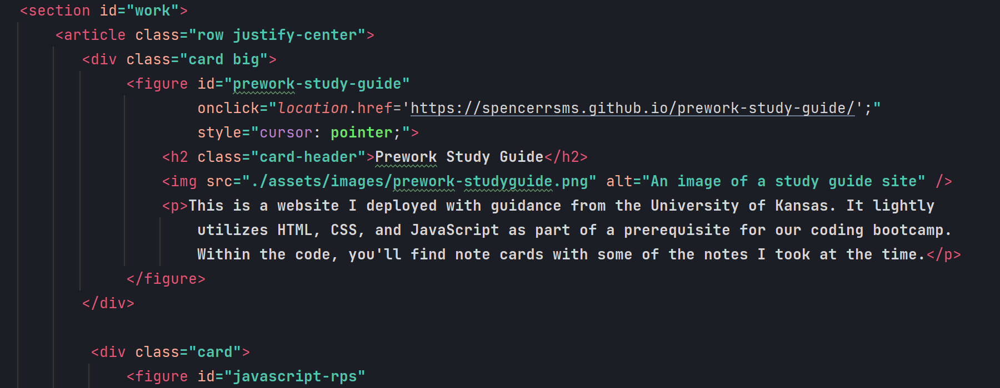
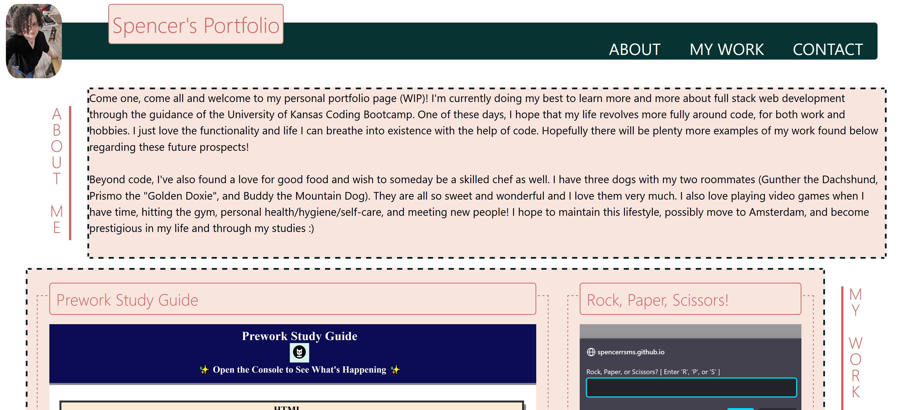

# Personal Portfolio - Module 2 Challenge - version 1

## Table of Contents

- [Description](#description)
- [Installation](#installation)
- [Usage](#usage)
- [Credits](#credits)
- [License](#license)
- [Code Example](#Code-Example)
- [Live Site](#Live-Site)

## Description
For this project, I have created a responsive website with advanced HTML, CSS, and some intermediate JavaScript.
It's a personal portfolio full of projects I've worked on with some personalization, I hope you all enjoy!

## Installation

(No installation required)

## Usage

Feel free to look around on the site and read about the many projects I've worked on recently. HINT: try clicking
around! Some functionality found within :)

Feel free to inspect the code! To open the Chrome DevTools,
try pressing Command+Option+I (macOS) or Control+Shift+I (Windows) while viewing the hosted site from within
Google Chrome.

## Credits

Created from scratch by Spencer Stewart!

Personal links:
[GitHub](https://github.com/SpencerRSMS/)
[LinkedIn](https://www.linkedin.com/in/r-spencer-stewart/)

## License

Please refer to the LICENSE file for more information.

## Features

Clickable figures, responsive design!
[GitHub repository](https://github.com/SpencerRSMS/portfolio-v1).

## Code-Example
#### Some Code Snippets:

## Live-Site
#### Click [here](https://spencerrsms.github.io/portfolio-v1/) for the [live site](https://spencerrsms.github.io/portfolio-v1/)!
